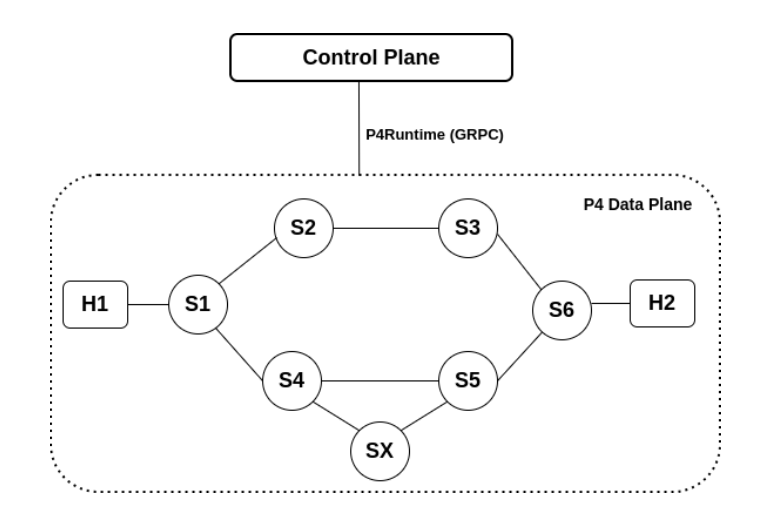
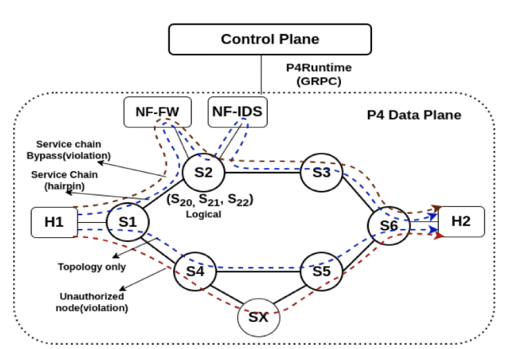
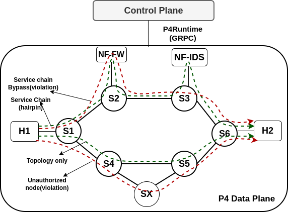

# VSlice: Slice Compliance State Machine (SCSM) PoC

This repository contains the Proof of Concept (PoC) implementation of the Slice Compliance State Machine (SCSM) for in-band network slice verification. It is built using the P4 programming language (BMv2) and a Python-based SDN controller over P4Runtime.

---

## Prerequisites

This project is designed to run within the standard [P4 Tutorial VM environment](https://github.com/p4lang/tutorials) (which includes `bmv2`, `p4c`, `mininet`, and `p4runtime`).

---

## topology 





---

## How to Run

### 1. Start the Data Plane (Mininet)

First, clear any existing Mininet state and start the network topology. This process will compile `scsm.p4` and boot up the switches (S1-S7) and hosts (H1, H2) defined in `topology.json`.

```bash
make clean
make
```

> Leave this terminal open. You will use the `mininet>` prompt for live testing later.

---

### 2. Start the Control Plane (SDN Controller)

Open a **second terminal** and run the Python controller. This script connects to the switches via P4Runtime (gRPC) and populates the match-action tables to provision the state machine rules for service chains C1 and C2.

```bash
python3 controller.py
```

> **Note:** You may see safe `[warn]` messages during provisioning if the controller attempts to install duplicate rules on shared switches (e.g., S1 and S6). The script will safely ignore these and complete the network setup.

---

## Testing and Validation

You can validate the compliance state machine using two methods:

* **Control-Plane Tracing**
* **Live Data-Plane Injection**

---

### Method A: Control Plane Trace Analysis

The controller includes a built-in testing engine that simulates packet traversal. It verifies:

* Path logic
* Service index progression
* Cryptographic `τ` chain calculations

In your **second terminal** (controller terminal), run:

```bash
python3 controller.py --test all
```

This will execute predefined scenarios and print a step-by-step trace showing:

* **Compliant Traversal:** Packets successfully navigating valid paths.
* **Service-Chain Bypass:** Violations triggered when a mandatory node is skipped.
* **Topology Violation:** Violations triggered when a packet traverses an unauthorized link.

---

### Method B: Live Data Plane Packet Injection

To prove the P4 data plane is actively enforcing the SCSM logic on live traffic, you can inject a raw packet directly into the Mininet network and watch it arrive at the destination.

#### 1. Start a Packet Sniffer on Egress (H2)

In your `mininet>` prompt, tell H2 to listen for exactly one incoming UDP packet and save the output to a text file in the background.

```bash
mininet> h2 tcpdump -i eth0 -n -A udp -c 1 > poc_success.txt 2>&1 &
```

---

#### 2. Inject the Compliant Packet from Ingress (H1)

Use Scapy to craft a UDP packet containing a custom payload and send it into the network.

```bash
mininet> h1 python3 -c "from scapy.all import Ether, IP, UDP, sendp; sendp(Ether(src='08:00:00:00:01:11', dst='08:00:00:00:02:22')/IP(src='10.0.1.1', dst='10.0.2.2')/UDP(dport=80)/'SCSM_POC_SUCCESS', iface='eth0')"
```

---

#### 3. Verify the Output

Read the captured packet file on H2 to confirm the custom payload successfully navigated the service chain, was validated at the egress switch, and had its compliance tag safely stripped before delivery.

```bash
mininet> h2 cat poc_success.txt
```

---

### Expected Result

You will see:

* `1 packet captured`
* The raw packet dump displaying the `SCSM_POC_SUCCESS` payload text.
